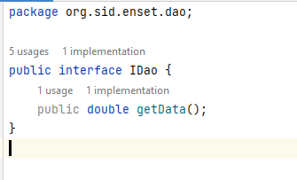
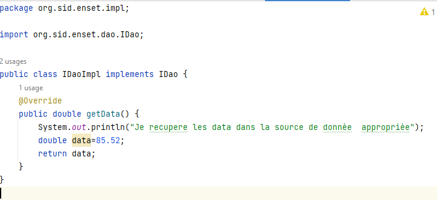
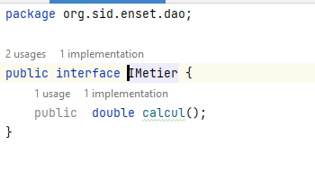
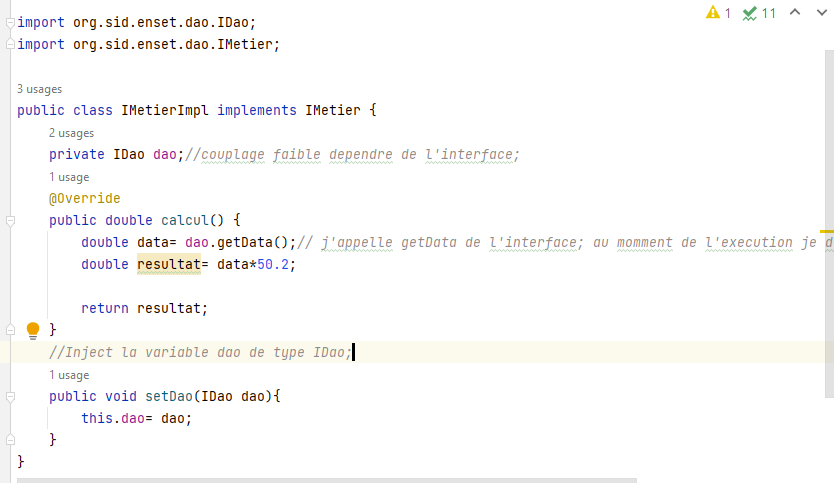
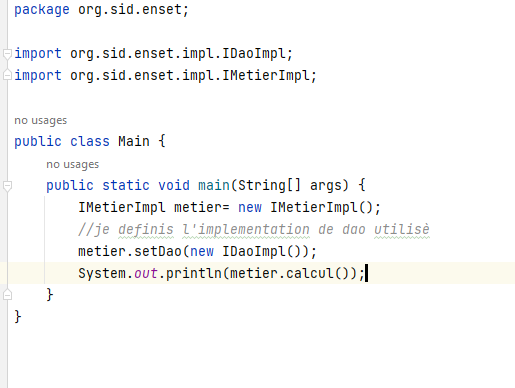

<h1>Activité Pratique N°1 - Injection des dépendances</h1>
<h4>1. Créer l'interface IDao avec une méthode getDate</h4>

<h4>2. Créer une implémentation de cette interface </h4>

<h4>3. Créer l'interface IMetier avec une méthode calcul </h4>

<h4>4. Créer une implémentation de cette interface en utilisant le couplage faible</h4>

<h4>5. Faire l'injection des dépendances :</h4>
<h4>a. Par instanciation statique:</h4>
